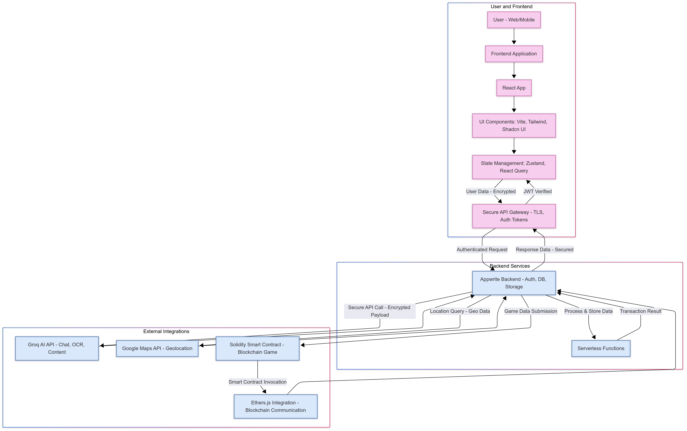
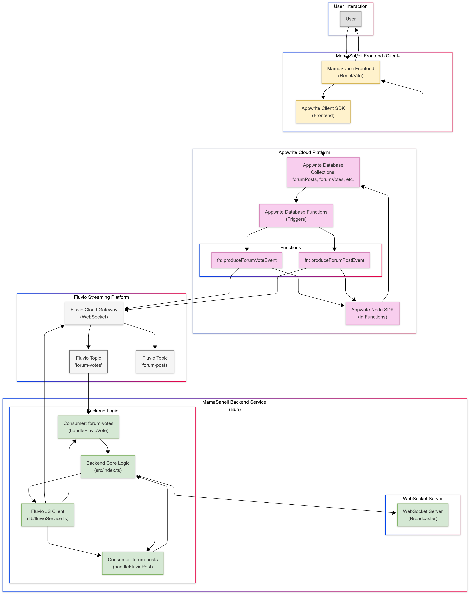
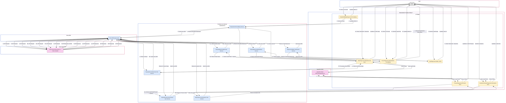
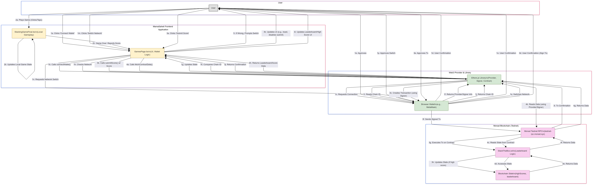

# MamaSaheli

**MamaSaheli** is a comprehensive, AI-powered platform designed to support expectant mothers throughout their pregnancy journey. It offers personalized health tracking, secure document management, real-time community support, and a suite of intelligent tools to provide a confident and informed experience.

**[Live Demo](https://mamasaheli.vercel.app/)**

---
# MamaSaheli

**MamaSaheli** is a comprehensive, AI-powered platform designed to support expectant mothers throughout their pregnancy journey. It offers personalized health tracking, secure document management, real-time community support, and a suite of intelligent tools to provide a confident and informed experience.

**[Live Demo](https://mamasaheli.vercel.app/)**

---

## ✨ Key Features

- ✅ **AI Chat Assistant (Gemini & Groq):** Personalized Q&A and **Document Transcription (OCR)** powered by fast, multimodal AI models.
- ✅ **Personalized Dashboard:** Tracks pregnancy milestones, upcoming appointments, medication reminders, and recent health readings with AI-generated insights.
- ✅ **Comprehensive Health Tracking:** Log and visualize key health metrics including Blood Pressure, Blood Sugar, and Weight.
- ✅ **Bloodwork Analysis:** Upload lab reports and leverage AI to extract, track, and visualize key biomarkers over time.
- ✅ **Appointment Scheduling:** Book and manage prenatal care appointments with your assigned healthcare provider.
- ✅ **Secure Medical Document Vault:** Upload, view, and manage medical records securely, powered by Appwrite Storage.
- ✅ **Real-Time Community Forum:** Create topics, post replies, and vote on content with real-time updates (via Fluvio) and AI-powered content moderation (via Groq).
- ✅ **Resources & Blog:** Access a rich library of articles, filterable by category, with AI-enhanced content formatting.
- ✅ **Emergency Hub:** Quick access to critical warning signs and a location-aware tool to find nearby hospitals using Google Maps.
- ✅ **AI-Powered Suggestions:** Get personalized meal ideas, safe exercise suggestions, and relevant product recommendations tailored to your profile and pregnancy stage.
- ✅ **Symptom Checker:** An informational tool providing AI-powered analysis of symptoms based on user input and profile context.
- ✅ **Blockchain Engagement (Monad):**
        - A fun stacking game with high scores submitted to a transparent, on-chain leaderboard on the Monad Testnet.
        - Mint unique, non-transferable NFT "milestone badges" for achieving key goals in the pregnancy journey.
- ✅ **Doctor's Portal:** A dedicated dashboard for healthcare providers to view assigned patients, their recent documents, and upcoming appointments.
- ✅ **Data Privacy & Management:** Easily export all your personal data in JSON or PDF format, or permanently delete your account and associated data.
- ✅ **Progressive Web App (PWA):** Installable on mobile and desktop devices for an app-like experience with offline capabilities.
- ✅ **Push Notifications:** Opt-in to receive timely reminders for appointments and medications via Firebase Cloud Messaging.
- ✅ **User Authentication & Profile (Appwrite):** Secure user registration, login, and comprehensive profile management.

---

## 🛠️ Tech Stack

- **Frontend:** React, TypeScript, Vite, Tailwind CSS, Shadcn UI
- **Backend-as-a-Service (BaaS):** Appwrite (Authentication, Databases, Storage, Functions)
- **Real-Time Streaming:** Fluvio / InfinyOn Cloud (via WebSocket Gateway)
- **AI Engines:** Google Gemini & Groq API (Llama 3 Models)
- **Blockchain:** Solidity, Ethers.js, Monad Testnet
- **State Management:** Zustand
- **Data Fetching:** TanStack Query (React Query)
- **Deployment:** Vercel (Frontend), Bun (Backend Server)
- **Additional Services:** Google Maps API, Firebase Cloud Messaging

---

## 🏛️ Architecture

The application is built on a robust, modern architecture leveraging a BaaS for core backend functionality, a real-time streaming platform for community features, and cutting-edge AI and blockchain services for intelligent and engaging user experiences.

**Overall Workflow:**


**Real-Time Dataflow (Fluvio):**


**AI Workflow (Groq):**


**Blockchain Interaction (Monad):**


---

## 📂 Project Structure

The repository is organized into several key directories:

```bash
git clone https://github.com/ADITYAVOFFICIAL/MamaSaheli.git
cd MamaSaheli
.
├── MamaSaheli-backend/   # WebSocket server for real-time Fluvio events
├── appwrite-functions/   # Serverless functions triggered by Appwrite events (e.g., new forum post)
├── contracts/            # Solidity smart contracts for Monad blockchain features
├── functions/            # Additional Appwrite serverless functions (e.g., user analytics)
├── public/               # Static assets, PWA manifest, service workers
├── src/                  # Main frontend application source code
│   ├── components/       # Reusable React components
│   ├── hooks/            # Custom React hooks
│   ├── lib/              # Client-side libraries, API helpers (Appwrite, AI, etc.)
│   ├── pages/            # Top-level page components for each route
│   └── store/            # Zustand state management store
└── ...                   # Root configuration files (Vite, Tailwind, Docker, etc.)
```

---

## 🚀 Getting Started

Follow these steps to set up and run the MamaSaheli project locally.

### 1. Prerequisites

- [Node.js](https://nodejs.org/) (v18 or later)
- [Bun](https://bun.sh/) (or `npm`/`yarn`)
- An [Appwrite Cloud](https://cloud.appwrite.io/) account.
- API Keys for:
        - Google Gemini
        - Groq
        - Google Maps (with Places API enabled)
        - Fluvio / InfinyOn Cloud
        - Firebase Project for Push Notifications

### 2. Clone the Repository

```bash
git clone https://github.com/ADITYAVOFFICIAL/MamaSaheli.git
cd MamaSaheli
```

### 3. Environment Variable Setup

You will need two separate `.env` files: one for the frontend (root directory) and one for the backend service.

**A. Frontend Environment (`.env.local`)**

Create a file named `.env.local` in the project's root directory. Populate it with your Appwrite, AI, and Google Maps keys.

```env
# Appwrite Configuration (Get these from your Appwrite project settings)
VITE_APPWRITE_ENDPOINT="https://cloud.appwrite.io/v1"
VITE_APPWRITE_PROJECT_ID="YOUR_APPWRITE_PROJECT_ID"
VITE_APPWRITE_BLOG_DATABASE_ID="YOUR_APPWRITE_DATABASE_ID"
VITE_APPWRITE_PROFILES_COLLECTION_ID="profiles"
VITE_APPWRITE_APPOINTMENTS_COLLECTION_ID="appointments"
VITE_APPWRITE_MEDICAL_DOCUMENTS_COLLECTION_ID="medicalDocuments"
VITE_APPWRITE_BLOG_COLLECTION_ID="blogs"
VITE_APPWRITE_BP_COLLECTION_ID="bloodPressure"
VITE_APPWRITE_SUGAR_COLLECTION_ID="bloodSugar"
VITE_APPWRITE_WEIGHT_COLLECTION_ID="weight"
VITE_APPWRITE_MEDS_COLLECTION_ID="medications"
VITE_APPWRITE_CHAT_HISTORY_COLLECTION_ID="chatHistory"
VITE_APPWRITE_BOOKMARKS_COLLECTION_ID="bookmarks"
VITE_APPWRITE_FORUM_TOPICS_COLLECTION_ID="forumTopics"
VITE_APPWRITE_FORUM_POSTS_COLLECTION_ID="forumPosts"
VITE_APPWRITE_FORUM_VOTES_COLLECTION_ID="forumVotes"
VITE_BLOODWORKS_COLLECTION_ID="bloodworks"
VITE_APPWRITE_PROFILE_BUCKET_ID="profilePhotos"
VITE_APPWRITE_MEDICAL_BUCKET_ID="medicalFiles"
VITE_APPWRITE_CHAT_IMAGES_BUCKET_ID="chatImages"
VITE_APPWRITE_MANAGE_USER_DATA="YOUR_MANAGE_USER_DATA_FUNCTION_ID"

# AI API Keys
VITE_GEMINI_API_KEY="YOUR_GOOGLE_GEMINI_API_KEY"
VITE_GROQ_API_KEY="YOUR_GROQ_API_KEY"

# Google Maps API Key
VITE_GOOGLE_MAPS_API_KEY="YOUR_GOOGLE_MAPS_API_KEY"
# Appwrite Configuration (Get these from your Appwrite project settings)
VITE_APPWRITE_ENDPOINT="https://cloud.appwrite.io/v1"
VITE_APPWRITE_PROJECT_ID="YOUR_APPWRITE_PROJECT_ID"
VITE_APPWRITE_BLOG_DATABASE_ID="YOUR_APPWRITE_DATABASE_ID"
VITE_APPWRITE_PROFILES_COLLECTION_ID="profiles"
VITE_APPWRITE_APPOINTMENTS_COLLECTION_ID="appointments"
VITE_APPWRITE_MEDICAL_DOCUMENTS_COLLECTION_ID="medicalDocuments"
VITE_APPWRITE_BLOG_COLLECTION_ID="blogs"
VITE_APPWRITE_BP_COLLECTION_ID="bloodPressure"
VITE_APPWRITE_SUGAR_COLLECTION_ID="bloodSugar"
VITE_APPWRITE_WEIGHT_COLLECTION_ID="weight"
VITE_APPWRITE_MEDS_COLLECTION_ID="medications"
VITE_APPWRITE_CHAT_HISTORY_COLLECTION_ID="chatHistory"
VITE_APPWRITE_BOOKMARKS_COLLECTION_ID="bookmarks"
VITE_APPWRITE_FORUM_TOPICS_COLLECTION_ID="forumTopics"
VITE_APPWRITE_FORUM_POSTS_COLLECTION_ID="forumPosts"
VITE_APPWRITE_FORUM_VOTES_COLLECTION_ID="forumVotes"
VITE_BLOODWORKS_COLLECTION_ID="bloodworks"
VITE_APPWRITE_PROFILE_BUCKET_ID="profilePhotos"
VITE_APPWRITE_MEDICAL_BUCKET_ID="medicalFiles"
VITE_APPWRITE_CHAT_IMAGES_BUCKET_ID="chatImages"
VITE_APPWRITE_MANAGE_USER_DATA="YOUR_MANAGE_USER_DATA_FUNCTION_ID"

# AI API Keys
VITE_GEMINI_API_KEY="YOUR_GOOGLE_GEMINI_API_KEY"
VITE_GROQ_API_KEY="YOUR_GROQ_API_KEY"

# Google Maps API Key
VITE_GOOGLE_MAPS_API_KEY="YOUR_GOOGLE_MAPS_API_KEY"
```env
# Fluvio Access Key (from InfinyOn Cloud)
VITE_FLUVIO_ACCESS_KEY="YOUR_FLUVIO_ACCESS_KEY"

# WebSocket Server Port
WEBSOCKET_PORT=8081
```
*(**Note:** For a complete list of required variables, refer to `src/utils/appwriteConfig.ts`)*

**B. Backend Environment (`MamaSaheli-backend/.env`)**

Create a file named `.env` inside the `MamaSaheli-backend/` directory.

```env
# Fluvio Access Key (from InfinyOn Cloud)
VITE_FLUVIO_ACCESS_KEY="YOUR_FLUVIO_ACCESS_KEY"

# WebSocket Server Port
WEBSOCKET_PORT=8081
```

### 4. Appwrite Project Setup

Before running the application, you must configure your Appwrite Cloud project.

### A. Create Project & Database

1. Log in to your Appwrite Cloud account and create a new project.
2. Note the **Project ID** and add it to your `.env.local` file.
3. Navigate to the **Databases** section and create a new database. Note the **Database ID** and add it to `.env.local`.

### B. Create Collections & Buckets

Inside your new database, create the collections and storage buckets listed in your `.env.local` file. You must **manually add the attributes and indexes** for each collection as defined in `src/utils/appwriteConfig.ts`. This step is crucial for the application's queries to work correctly.

- **Collections:** `profiles`, `appointments`, `medicalDocuments`, `blogs`, `bloodPressure`, `bloodSugar`, `weight`, `medications`, `chatHistory`, `bookmarks`, `forumTopics`, `forumPosts`, `forumVotes`, `bloodworks`.
- **Storage Buckets:** `profilePhotos`, `medicalFiles`, `chatImages`.

### C. Deploy Functions

Deploy the serverless functions using the [Appwrite CLI](https://appwrite.io/docs/command-line).

1. Install and log in to the Appwrite CLI: `appwrite login`.
1. Link your local project: `appwrite init project`.
1. Deploy the functions one by one:

```bash
    # Deploy user analytics function
    appwrite deploy function --functionId <YOUR_GETUSERCOUNT_FUNCTION_ID> --path functions/getUserCount
    
    # Deploy forum event producers
    appwrite deploy function --functionId <YOUR_PRODUCEFORUMPOSTEVENT_FUNCTION_ID> --path appwrite-functions/produceForumPostEvent
    appwrite deploy function --functionId <YOUR_PRODUCEFORUMVOTEEVENT_FUNCTION_ID> --path appwrite-functions/produceForumVoteEvent

    # Deploy user data management function
    appwrite deploy function --functionId <YOUR_MANAGEUSERDATA_FUNCTION_ID> --path appwrite-functions/manageUserData
```

1. After deploying, go to the Appwrite Console for each function to set the required **environment variables** and **event triggers**. Refer to the README files within each function's directory for specific requirements.

### 5. Install Dependencies & Run

### A. Backend Service (Fluvio Consumer)

Open a terminal for the backend service.

```bash
cd MamaSaheli-backend
bun install
bun run dev
```

### B. Frontend Application

Open a separate terminal for the frontend application.

```bash
# From the project root directory
bun install
bun run dev
```

The application should now be running on `http://localhost:8080`.

---

## 🔮 Future Scope

- ⛓️ **Digital Healthcare Records:** A secure, blockchain-based platform for storing and sharing electronic health records, ensuring data privacy and easy access for patients and healthcare providers.
- 🎓 **EduTech Interactive Learning Platform:** A web3-based interactive learning platform that uses gamification and AR/VR to make education engaging and accessible for students in remote areas.
- ⌚ **Wearable Device Integration:** Integration with smartwatches (e.g., Google Wear OS, Samsung Galaxy Watch) for at-a-glance notifications, quick health metric logging, and medication reminders directly on the user's wrist.
- 🛡️ **Enhanced Security & Privacy:** Implement data encryption at rest and in transit where applicable and conduct a thorough review of Appwrite permissions.
- 🌐 **Localization & Accessibility:** Add support for multiple languages (i18n) and improve compliance with accessibility standards (WCAG).
- ☁️ **Scalability & Optimization:** For large-scale traffic, migrate backend components to dedicated cloud services and optimize API usage.

---

## 📜 License

This project is licensed under the MIT License. See the [LICENSE](LICENSE) file for details.

---

## 🖇️ Acknowledgements

- **Frameworks/Libraries:** React, Vite, TypeScript, Tailwind CSS, Shadcn UI, Ethers.js, TanStack Query, Zustand.
- **Services:** Appwrite, Google Gemini, Groq, Fluvio/InfinyOn, Vercel, Google Maps, Firebase.
- **Blockchain Platform:** Monad.
